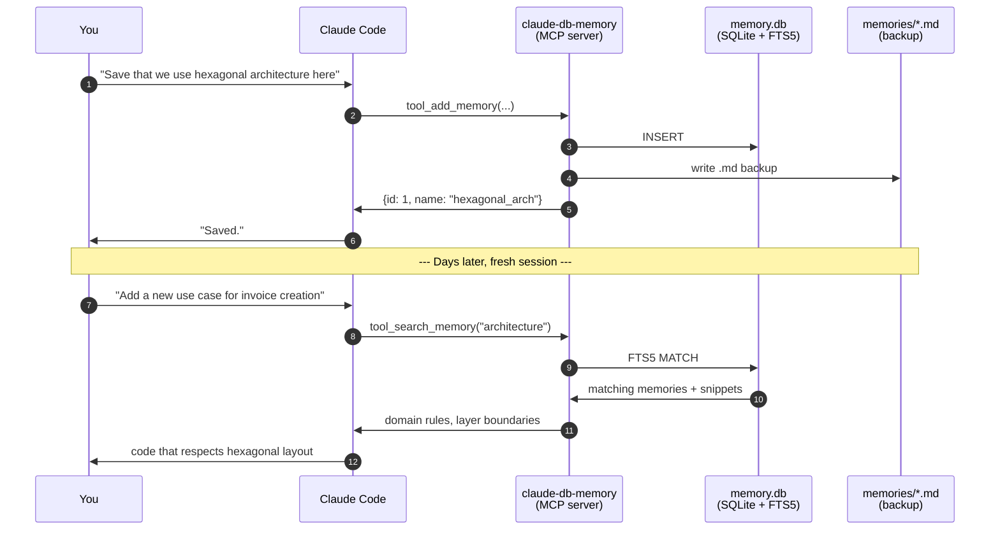

# claude-db-memory

SQLite-backed long-term memory for Claude Code with FTS5 search and Markdown backup.

## Why

Claude Code's native memory stores entries as Markdown files indexed by `MEMORY.md`, which is auto-loaded into the system prompt at session start. The index is truncated after ~200 lines, so memories silently disappear past that limit. There is no search, no filtering, and no scaling beyond a few dozen entries.

`claude-db-memory` keeps the auto-loaded `MEMORY.md` compatibility but moves the source of truth to a local SQLite database with FTS5 full-text search. Markdown files become a versionable backup layer that can recover the database at any time.

## When does this plugin make sense?

Not always. The plugin adds a small fixed cost per session (~600 tokens of MCP tool schemas). That cost only pays off once you accumulate enough memories that the native system starts hurting you.

| Memory count | Native Claude Code behavior | With `claude-db-memory` | Worth installing? |
|---|---|---|---|
| **1–20** | Works fine, `MEMORY.md` fits comfortably | Adds ~600 tokens of overhead per session | ❌ Overkill |
| **20–80** | Still works, `MEMORY.md` getting long | Search + filters start adding value | 🟡 Break-even |
| **80–200** | `MEMORY.md` near the auto-load limit | Compact auto-index, real search | ✅ Worth it |
| **200+** | **Silently truncates** — memories beyond line 200 stop loading into context | No ceiling, FTS5 search, filters by type/project/tags | ✅ Strongly recommended |
| **1000+** | Catastrophic — most memories invisible to Claude | Same — query and retrieval scale to thousands | ✅ Required |

The headline value isn't ahorro of tokens at small scale — it's **removing the silent truncation ceiling** of the native system. Once you cross ~200 lines in `MEMORY.md`, the native system stops loading the rest, and you don't get told. This plugin keeps every memory addressable forever, with full-text search.

If you have fewer than ~50 memories today and don't expect to grow, **the native system is fine** and you don't need this. Install it when (or just before) you cross 100.

## Install

### As a Claude Code plugin

```bash
/plugin install github:Endika/claude-db-memory
```

### Manual

```bash
git clone https://github.com/Endika/claude-db-memory ~/.claude/plugins/claude-db-memory
cd ~/.claude/plugins/claude-db-memory
pip install -e .
```

Claude Code reads `.claude-plugin/plugin.json` and registers the MCP server automatically.

## CLI

```bash
# Save a coding preference Claude should respect across sessions
memory add --type feedback --name typescript_strict \
    --description "Always use TypeScript strict mode; reject 'any'" \
    --body "Force strict: true in tsconfig. Reject 'as any' casts; use 'unknown' + type guards instead." \
    --tags "typescript,types"

# Search across all memories (full-text, FTS5)
memory search "strict mode"

# Filter list by type
memory list --type feedback

# Look up a specific memory
memory get typescript_strict

# Update a memory
memory update typescript_strict --description "Strict TypeScript only; document any escape hatches"

# Delete one
memory delete typescript_strict

# Maintenance
memory reindex     # rebuild SQLite from .md files (recovery)
memory verify      # detect drift between .md and DB
memory export      # regenerate .md backups from DB
```

Add `--json` to any command for machine-readable output.

## MCP tools

When installed as a plugin, Claude Code can call these tools directly during a conversation:

| Tool | What it does |
|---|---|
| `tool_add_memory` | Persist a new memory with name, type, description, body, tags, project |
| `tool_search_memory` | Full-text search with optional `type` / `project` filters |
| `tool_get_memory` | Fetch one memory by id or name |
| `tool_update_memory` | Modify fields of an existing memory |
| `tool_delete_memory` | Remove a memory from DB and `.md` backup |
| `tool_list_memories` | Paginated list, filterable by type and project |
| `tool_reindex` | Rebuild SQLite from `.md` backup |
| `tool_verify` | Report drift between SQLite and `.md` files |

## How it works



## Before vs after

| Without the plugin | With the plugin |
|---|---|
| You re-explain your repo conventions every session. | Claude knows them from memory and applies them automatically. |
| `MEMORY.md` grows past 200 lines and silently truncates. | Index stays compact; full content always searchable. |
| No way to filter "all feedback about testing". | `memory list --type feedback --tags testing`. |
| Cross-session continuity is lost when conversation history rotates. | Persistent context survives indefinitely. |
| Knowledge lives in your head; new teammates can't import yours. | `.md` backups can be shared via git for team-wide context. |

## Real-world use cases

Five concrete scenarios mapped to the five memory types. Each row shows what you say, how it gets stored, and how Claude behaves later.

---

There are two ways to create memories: ask Claude in a session (he calls `tool_add_memory` for you) or run the CLI directly. Each scenario below shows both: what you'd say to Claude in natural language, and the equivalent CLI command you can copy-paste right now.

---

### 🏛️ Project — codify repo conventions

> 💬 **In a Claude session:** *"Save that this repo uses hexagonal architecture: domain in `src/domain/` with zero external imports, adapters under `src/adapters/`, use cases under `src/application/`."*

📟 **Or directly from the terminal:**

```bash
memory add --type project --name hexagonal_architecture \
  --description "Repo uses hexagonal architecture; domain layer is pure" \
  --body "Domain logic in src/domain/ with zero external imports.
Adapters under src/adapters/. Use cases under src/application/.
Never import infrastructure from domain. Tests for domain
should not require any DB or HTTP." \
  --tags "architecture,ddd" \
  --project my-service
```

> ✅ **Later:** when you ask "add a new use case for invoice creation", Claude searches memories tagged `architecture`, sees the rules, and produces code that goes in the right layers without you re-stating them.

---

### 🎨 User — personal Claude tuning

> 💬 **In a Claude session:** *"Remember that I want concise answers without preamble, and you don't need to explain what the code does unless I ask."*

📟 **Or directly from the terminal:**

```bash
memory add --type user --name response_style_terse \
  --description "Prefer concise responses, no preamble" \
  --body "Default to terse answers. Skip 'Great question!' filler.
Don't explain what code does unless explicitly asked.
For exploratory questions, 2-3 sentences with a recommendation." \
  --tags "tone,preferences"
```

> ✅ **Later:** every session opens with this loaded into context. Claude skips "Great question!" filler from message 1.

---

### ⚠️ Feedback — never repeat a past mistake

> 💬 **In a Claude session:** *"Never mock the DB in integration tests for this repo. We got burned last quarter — a mocked test passed in CI but the prod migration broke because column types diverged."*

📟 **Or directly from the terminal:**

```bash
memory add --type feedback --name never_mock_db_in_integration \
  --description "DB mocks caused a prod migration failure last quarter" \
  --body "Integration tests must hit a real PostgreSQL instance.
A mocked test passed in CI but the prod migration broke because
column types diverged. Use docker-compose with a real DB even
if slower." \
  --tags "testing,migrations,incident" \
  --project my-service
```

> ✅ **Later:** when you ask "add an integration test for the orders table", Claude proposes spinning up a real Postgres in docker-compose instead of mocking, and explains why (citing your past incident).

---

### 🔗 Reference — point Claude to the right place

> 💬 **In a Claude session:** *"The auth service in our org lives at `services/auth-platform`, not in the main app repo. When I ask about authentication, that's the actual code."*

📟 **Or directly from the terminal:**

```bash
memory add --type reference --name auth_service_location \
  --description "Auth lives in services/auth-platform, not the main app" \
  --body "When working on auth flows, the actual implementation
is in github.com/myorg/services/auth-platform. The main app
only consumes its API. JWT signing keys are in 1Password
under 'auth-platform-prod-keys'." \
  --tags "auth,architecture"
```

> ✅ **Later:** asking "how does login work?" makes Claude direct you to the right repo and read code from there, instead of grep'ing the wrong codebase.

---

### 📝 Note — operational knowledge

> 💬 **In a Claude session:** *"Document the deploy procedure: merge to main → staging deploys → run smoke-test.sh → tag `release-YYYY-MM-DD` → prod deploys → watch grafana for 10 min."*

📟 **Or directly from the terminal:**

```bash
memory add --type note --name deploy_workflow \
  --description "Production deploy procedure for this service" \
  --body "1. Merge to main triggers staging deploy automatically.
2. Run ./scripts/smoke-test.sh against staging.
3. Tag with 'release-YYYY-MM-DD' to trigger prod deploy.
4. Watch grafana.internal/d/api-latency for 10 min after.
5. Rollback: 'git revert' + new tag, never force-push." \
  --tags "deploy,ops,runbook" \
  --project my-service
```

> ✅ **Later:** you say "deploy v1.4.2" and Claude walks you through *your* exact procedure, not a generic one. Plus you can pipe the body for a printable runbook:
>
> ```bash
> memory get deploy_workflow --json | jq -r .body
> ```

---

## What the auto-generated index looks like

Every `add` / `update` / `delete` regenerates `MEMORY.md` (which Claude Code auto-loads at session start). It stays compact regardless of total memory count:

```markdown
# Memory Index

## feedback
- [never_mock_db_in_integration](memories/never_mock_db_in_integration.md) — DB mocks caused a prod migration failure last quarter
- [response_style_terse](memories/response_style_terse.md) — Prefer concise responses, no preamble

## note
- [deploy_workflow](memories/deploy_workflow.md) — Production deploy procedure for this service

## project
- [hexagonal_architecture](memories/hexagonal_architecture.md) — Repo uses hexagonal architecture; domain layer is pure

## reference
- [auth_service_location](memories/auth_service_location.md) — Auth lives in services/auth-platform, not the main app
```

One line per memory, grouped by type. At 500 memories it's still ~510 lines instead of thousands — Claude Code auto-loads it without truncation, and the full body of each memory is fetched on demand via `tool_search_memory` or `tool_get_memory`.

## Storage

By default the plugin stores data per workspace at:

```
~/.claude/projects/<workspace>/memory/
├── MEMORY.md            # auto-generated index, auto-loaded by Claude Code
├── memory.db            # SQLite, gitignored
└── memories/            # .md backup
```

Override with `CLAUDE_DB_MEMORY_DIR=/path/to/dir` for a global memory shared across workspaces.

## Development

```bash
make install        # pip install -e ".[dev]"
make check          # lint + type-check + tests
make format         # auto-format (ruff)
make test           # pytest only
make test-cov       # pytest with coverage
```

## Release process

This project uses [Release Please](https://github.com/googleapis/release-please) to automate versioning and releases based on [Conventional Commits](https://www.conventionalcommits.org/).

- Every commit on `main` triggers Release Please.
- It maintains a release PR that aggregates pending changes into `CHANGELOG.md` and bumps the version in `pyproject.toml`.
- Merging the release PR creates a tag (`vX.Y.Z`) and a GitHub release.

Conventional commit prefixes:
- `feat:` -> minor version bump
- `fix:` -> patch version bump
- `feat!:` / `BREAKING CHANGE:` -> major version bump
- `chore:`, `docs:`, `ci:`, `refactor:`, `test:` -> no version bump (still appear in changelog under their section)

## Continuous integration

GitHub Actions runs three parallel jobs on every push and PR:

- **lint** -- `ruff check` + `ruff format --check`
- **type-check** -- `mypy`
- **test** -- `pytest` on Python 3.10, 3.11, 3.12

## License

MIT.
